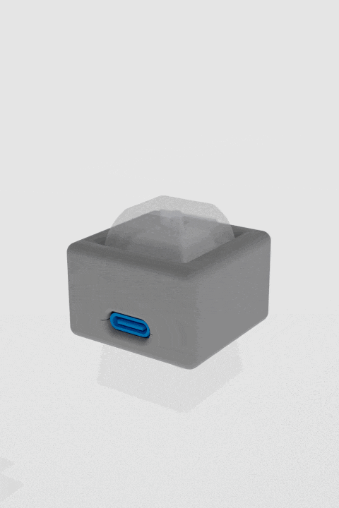

<table>
  <tr>
    <td width="48%" valign="top">
      
    </td>
    <td width="52%" valign="top">
      <h1 align="center">Titian-1K-Macropad</h1>
      <p>A simple, programmable single-key macropad powered by <strong>QMK/Vial</strong>.</p>
      <p>It uses an RP2040 microcontroller (specifically the RP2040-Zero) and supports dynamic keymap configuration via Vial Web.</p>
    </td>
  </tr>
</table>

## How to use with vial.rocks

The Titan Macropad supports on-the-fly configuration using Vial without needing to install any software.

1. Plug in the macropad that is running the Vial firmware.
2. Open a Chromium-based web browser (like Chrome, Edge, or Brave).
3. Navigate to [vial.rocks](https://vial.rocks/).
4. Click the "Start Vial Web" button.
5. Click "Authorize Device" and select your Titan Macropad from the prompt.
6. You can now visually configure the keymap, macros, and RGB lighting directly from your browser. Any changes you make are instantly saved to the macropad's memory.

## 3D Model

The 3D models for the case and bottom plate can be found in the /models directory of this repository, or you can view and copy & modify the original Onshape document here:
[Titan-1k-macropad Onshape Document](https://cad.onshape.com/documents/c0aad09dc532ca914c3bfaad/w/9beb9ffb02040a9ba25e0679/e/31151e2bd11e1364a81abe74?renderMode=0&uiState=699e713fefc521e560dffe93)

## Wiring

The wiring is extremely straightforward as it uses direct pins without a matrix:

1. Switch: Connect one pin of your mechanical switch to the GP0 pad on the RP2040-Zero, and the other pin to a GND pad.
2. RGB Lighting: The firmware is already configured to use the onboard WS2812 RGB LED found on the RP2040-Zero (connected internally to GP16).

## Compiling the Firmware

To compile the firmware, you will need to set up a Vial-QMK build environment.

**1. Set up the environment (Linux)**
```bash
sudo apt update && sudo apt install -y git python3-venv python3-pip
git clone [https://github.com/vial-kb/vial-qmk.git](https://github.com/vial-kb/vial-qmk.git)
cd vial-qmk && make git-submodule

# Clone the macropad repository and move the hardware folder into QMK
git clone [https://github.com/JinRecords/titan-1k-keypad.git](https://github.com/JinRecords/titan-1k-keypad.git)
mv titan-1k-keypad/titanmacropad vial-qmk/keyboards/
cd vial-qmk

# Use a virtual environment
python3 -m venv .venv
source .venv/bin/activate
pip install -r requirements.txt

# Link QMK and apply USB hardware permissions
qmk setup -H .
sudo cp util/udev/50-qmk.rules /etc/udev/rules.d/
sudo udevadm control --reload-rules && sudo udevadm trigger
```

**2. Compiling the firmware**

`qmk compile -kb titanmacropad -km vial`
This generates `titanmacropad_vial.uf2` in the root of your vial-qmk folder.

## Loading the Firmware

Once compiled, you will have a .uf2 file.
1. Remove the switch from the macropad, 2 buttons can be seen. The reset button is located on the right side while the usb port is facing you.
2. While plugging the RP2040-Zero into your computer via USB, press and hold the BOOT button with something pointy and thin on the microcontroller.
3. A new mass storage drive named RPI-RP2 will appear on your computer.
4. Drag and drop (or copy and paste) the compiled .uf2 file onto the RPI-RP2 drive.
5. The microcontroller will automatically flash the firmware and reboot. Your macropad is now ready to use!
